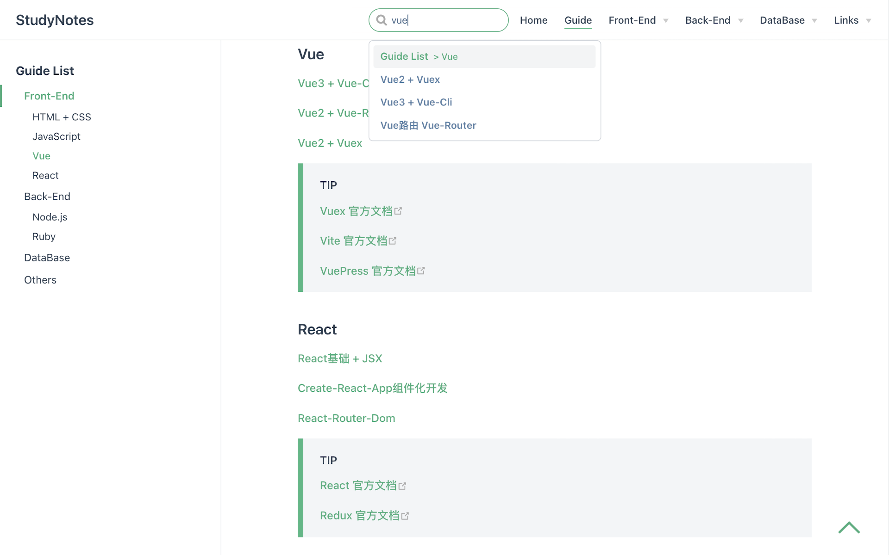

# Vuepress Static Document Site

[Demo](https://blaxberry.github.io/vuepress-studynotes/)

[Dev Branch](https://github.com/BlaxBerry/vuepress-studynotes/tree/dev)

[Markdown](https://github.com/BlaxBerry/vuepress-studynotes/tree/dev/docs/notes)




## How To Update

1. Clone repository

```bash
git clone https://github.com/BlaxBerry/vuepress-studynotes.git
```

2. Install modules

```bash
npm install
```

3. **Work at `dev` branch**

```bash
git checkcout dev
```

4. Build after developing at `dev` branch

```bash
npm run docs:build
```

5. Copy `dist` 's content to `main` branch

```js
|- docs
    |- .vuepress
        |- dist  // this one
|- package.json
|- ...
```

```bash
git checkout main
```

6. Upload `main` branch

```bash
git push
```
